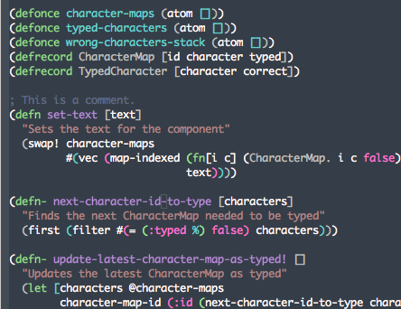

### Sookie theme

This theme is dedicated to my dog, the sweetest sharpei in the world.

The colors are sweet, with decent contrast and isn't hard in the eye.

### Example



### Usage

Just load-file it in your .emacs

```elisp
(load-file "path-where-you-cloned-this-repo/sookie.el")
```

## Caveats

Currently there's only the emacs version here, feel free to copy it to your own text editor.

### Want to help?

Help me to get this package to MELPA and not autoload the theme, but let it be specifiable in .emacs